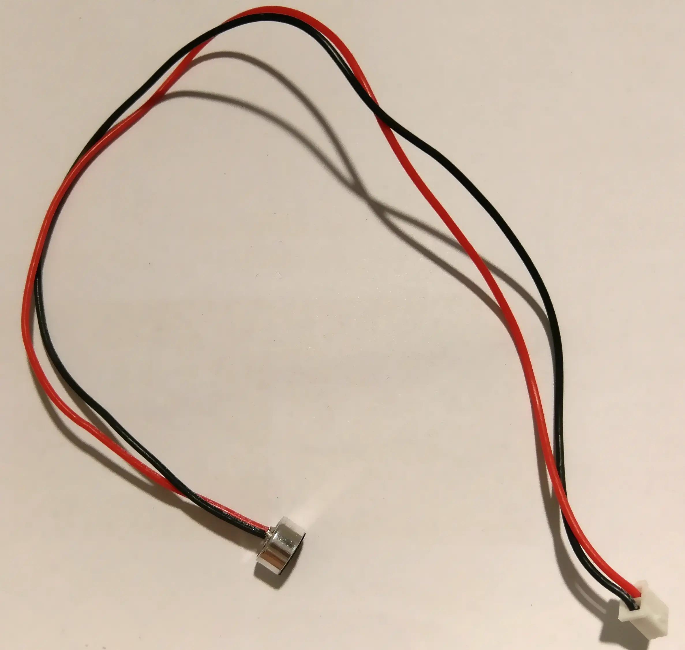
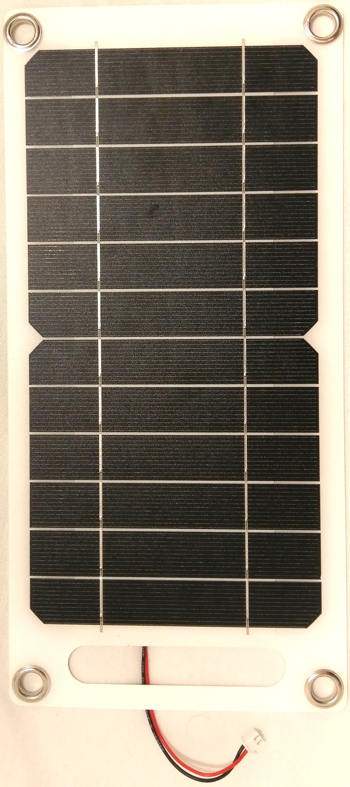
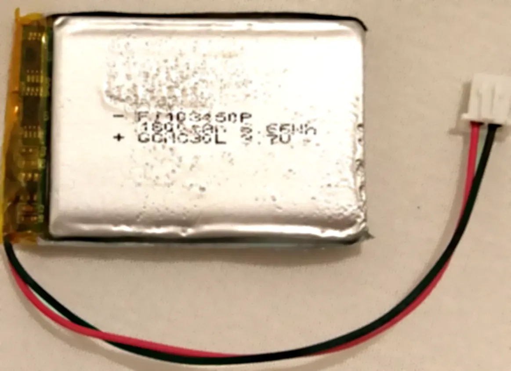
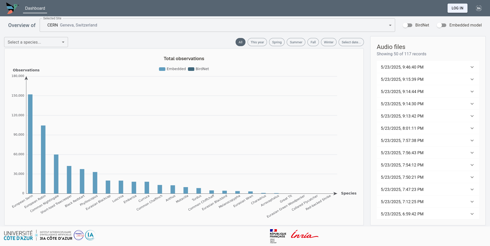
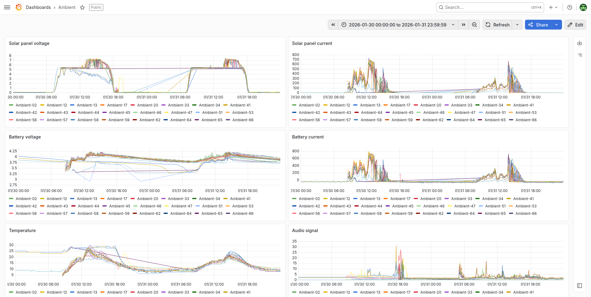

# Ambient

The Ambient project strives to provide a biodiversity monitoring platform built around an autonomous smart sensor node deployed in the wild.

Currently, the project focuses on birdsong recording and recognition for bird species classification.

The hardware and firmware project sources are provided as open-source (hardware: CERN-OHL-P-2.0 license, software: Apache-2.0 license) for anyone to build, improve and extend the platform.

TODO: insert picture of bird house

## Disclaimer

Provided as-is, no guarantee or responsibility
No CE, FCC
No battery safety tests

## Hardware

The hardware platform consists of an autonomous sensor node built inside a birdhouse.

TODO: add system diagram

### Mainboard

The mainboard contains the microcontroller (STMicroelectronics STM32U595RI) as well as several sensors and modules:
- Micro-SD card reader
- LoRa modem (Ebyte E22-900M22S)
- GNSS module (Quectel L96-M33)
- Temperature, humidity and pressure (Bosch BME280)

The LoRa antenna PCB is mounted on top of the mainboard, and the daughterboard is connnected to the underside.

    
    

For more information, refer to the dedicated repository: [Ambient DKAIoT](https://github.com/LEAT-EDGE/ambient-pcb-dkaiot)

### Antenna

LoRa antenna mounted on top of the mainboard, designed for operation in the EU868 band.

    
    

For more information, refer to the dedicated repository: [Ambient Antenna](https://github.com/LEAT-EDGE/ambient-pcb-antenna)

### Daughterboard: audio capture & energy management

The daughterboard is an custom extension PCB that plugs into the mainboard and contains the following sub-circuits to extend the feature set of the mainboard:
- energy management:
  - Li-ion/LiPo charging circuit from photovoltaic cell with maximum power-point control (Consonance CN3791 controller),
  - solar and battery current and voltage monitoring (Texas Instrument INA3221 monitor),
- audio capture:
  - analog-to-digital converter with microphone input amplification and digital filtering (Texas Instrument TLV320ADC3101),
  - analog audio wake-up circuit with high-pass filter and threshold detector.

    
    

For more information, refer to the dedicated repository: [Ambient AudioPowerBoard](https://github.com/LEAT-EDGE/ambient-pcb-audiopower)

### Microphone

We chose to use the PUI Audio AOM-5024L-HD-R electret condenser microphone for its high sensitivity and low noise figures:

[PUI Audio AOM-5024L-HD-R](https://www.digikey.com/en/products/detail/pui-audio-inc/AOM-5024L-HD-R/7898328)

Other electret condenser microphone can be used. The configured gain of the ADC's (Texas Instrument TLV320ADC3101) internal amplifier may need to be adjusted (see [Zephyr ADC3101 settings](https://github.com/LEAT-EDGE/ambient-firmware-zephyr/blob/main/app_all_task/src/ADC3101.c) or [Arduino ADC3101 settings](https://github.com/LEAT-EDGE/ambient-firmware-arduino/blob/master/ADC3101.cpp).

Wires should be soldered to the microphone pads and terminated with a 2-pin JST XH-series 2.54mm male connector (pin 1: positive, pin 2: negative).

### Solar panel

We use a 300×145mm solar panel such as this:
<https://fr.aliexpress.com/item/1005007613448154.html>

They are often listed as 30 W or 35 W solar panel for USB charging. The actual output power, even under perfect conditions, is much lower than advertised (below 7 W) but sufficient for our needs since the charging current of the battery is limited to ~800 mA at 4.2 V.

The voltage regulator module with a female USB-A port should be removed from the solar panel. Wires should be soldered directly to the leftover tabs and terminated with a 2-pin JST XH-series 2.54mm male connector (pin 1: positive, pin 2: negative).

Any other solar panel can be used, provided their operating voltage is above 4.6 V and their maximum open-circuit voltage is below 20 V. The MPPT potentiometer on the daugtherboard should be adjusted accordingly.

### Battery

Currently, a single-cell 1800 mAh LiPo battery with built-in protection circuit is used:

[RS PRO 144-9405: 3.7 V, Lithium Polymer Rechargeable Battery, 1.8 Ah](https://export.rsdelivers.com/product/rs-pro/rs-pro-37-v-lithium-polymer-rechargeable-battery/1449405)

Only single-cell Li-ion or LiPo batteries **with built-in protection circuit** and rated for min. 800 mA charge current should be used in the device.

Wires should be terminated with a 2-pin JST XH-series 2.54mm male connector (pin 1: positive, pin 2: negative).

**Disclaimer**: Due to safety concern regarding lithium chemistry in batteries, it is currently not recommended to leave the device unattended, and we decline any responsibility in case of mishappenings. The chosen battery is UN38.3-compliant, but its use in the device has not been validated.

## Software

### Embedded firmware

The [current firmware](https://github.com/LEAT-EDGE/ambient-firmware-zephyr) leverages the Zephyr real-time operating system.

The [older firmware](https://github.com/LEAT-EDGE/ambient-firmware-arduino) relies on Arduino's libraries

### Embedded artificial neural network

The artificial neural network for bird song classification is deployed onto the microcontroller thanks to the [Qualia framework](https://github.com/LEAT-EDGE/qualia).

### 3IA dashboard

A [web dashboard](https://3ia-demos.inria.fr/ezbird/dashboard) is currently in development by [3IA Côte d'Azur](https://3ia.univ-cotedazur.eu/).

The dashboard can display statistics collected from the data sent through LoRaWAN and from the audio samples of the SD cards analyzed offline. Audio samples are also available for listening.

Source code is not published yet.

### Grafana dashboard

The data sent through LoRaWAN can be collected inside an InfluxDB database and displayed on a Grafana dashboard.

Configuration for a Node-RED middlware fetching data from a ChirpStack v4 LoRaWAN server and inserting it into an InfluxDB as well as a Grafana dashboard are available in the [`conf/` directory](https://github.com/LEAT-EDGE/ambient/tree/main/conf).

## Acknowledgment

This project has received funding from [Université Côte d'Azur](https://leat.univ-cotedazur.fr/) and [CERN](https://home.cern/).
